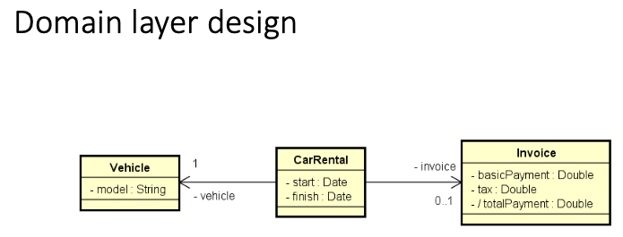
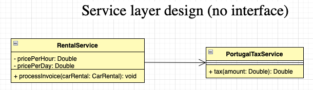
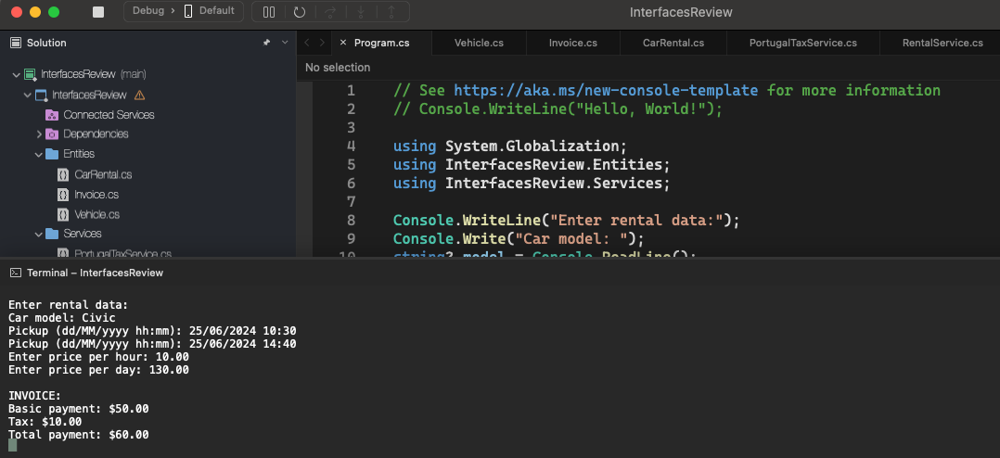

# Interfaces Review

    - A Portuguese car rental company charges an hourly rate for rentals of up to 12 hours. However, if the rental length exceeds 12 hours, the rental will be charged on a daily rate. In addition to the rental value, the tax value is added to the price according to the country's rules which, in the case of Portugal, is 20% for values ​​up to 100.00, or 15% for values ​​above 100.00. Create a program that reads the rental data (car model, starting and ending times of the rental), as well as the hourly value and daily rental value. The program must then generate the payment note (containing the rental amount, tax amount and total payment amount) and enter the data on the screen.
    - Version without interface;

  

  

    • Strong coupling;
    • The RentalService class knows the concrete dependency;
    • If the concrete class changes, you need to change the RentalService class;

  

