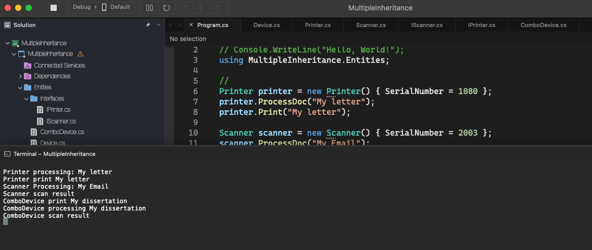
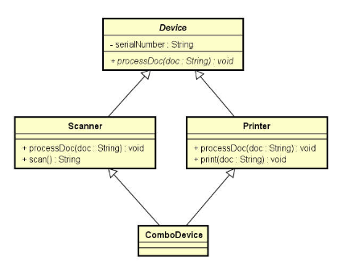
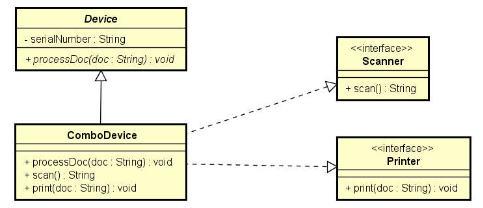

# Multiple Inheritance

    - Example of a multiple Inheritance;

  

### Multiple inheritance and the diamond problem

##### Diamond problem

    - Multiple inheritance can generate the diamond problem: an ambiguity caused by the existence of the same method in more than one superclass;
    - Multiple inheritance is not allowed in most languages;

  

#### However, a class (or struct) can implement more than one interface

    - ATTENTION:
      This is NOT multiple inheritance, as there is NO REUSE in the relationship between ComboDevice and the Scanner and Printer interfaces;
      ComboDevide does not inherit, but implements the interfaces (fulfills the contract);

  

