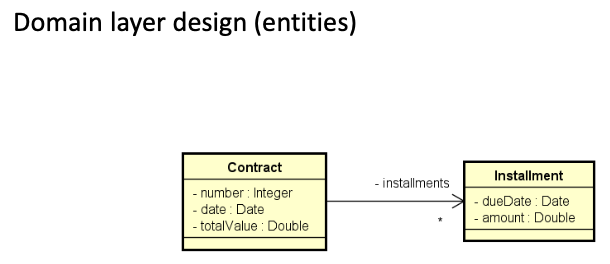
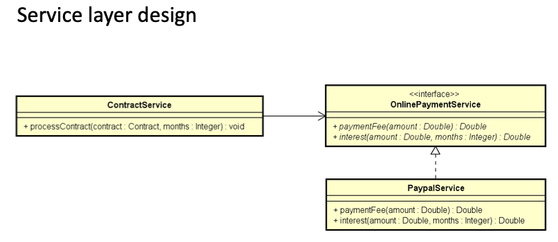
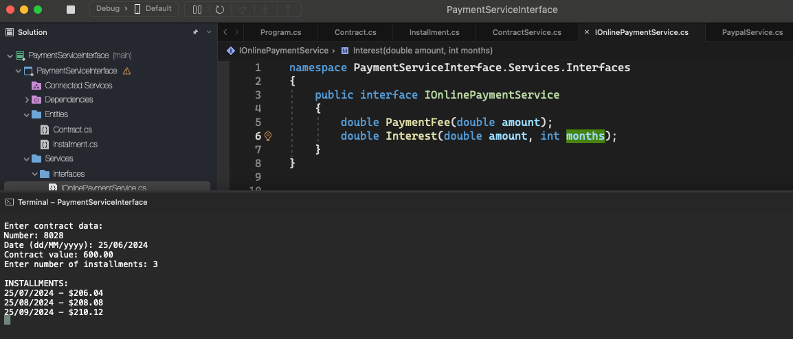
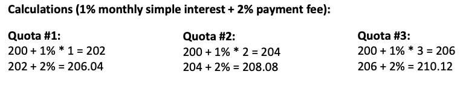

# Payment Service Interface

    - A company wants to automate the processing of its contracts. Processing a contract consists of generating the installments to be paid for that contract, based on the desired number of months.
    The company uses an online payment service to pay installments. Online payment services typically charge a monthly interest as well as a per-payment fee. For now, the service contracted by the company is Paypal, which applies simple interest of 1% to each installment, plus a payment fee of 2%.
    Make a program to read data from a contract (contract number, contract date, and total contract value). Next, the program must read the number of months for the contract to be paid in installments, and then generate records of installments to be paid (date and value), with the first installment being paid one month after the date of the contract, the second installment two months after the contract and so on. Show installment data on the screen.

  

  

  

  

