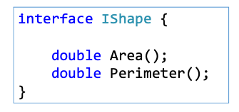

# 14 Section - Interfaces

    - In this section we recap Interfaces in C#;

### Interfaces

    - Interface is a type that defines a set of operations that a class (or struct) must implement;
    - The interface establishes a contract that the class (or struct) must fulfill;
    - Why interfaces?
      • To create loosely coupled and flexible systems;interface

  

### Inversion of control

    • Inversion of control:
      Development pattern that consists of removing from class a responsibility for instantiating your dependencies;

    • Dependency Injection:
      It's a way of performing inversion of control: an external component instantiates the dependency, which is then injected into the "parent" object. It can be implemented in several ways:
        • Builder;
        • Instantiation object (builder/factory);
        • Container/framework;

### Dependency Injection (DI)

    - It allows us to develop loosely-coupled code that is easy to maintain. Dependency Injection reduces the hard-coded dependencies among your classes by injecting those dependencies at run time instead of design time technically;

### IComparable Interface

    - https://msdn.microsoft.com/en-us/library/system.icomparable(v=vs.110).aspx
    - This interface provides different types of type-specific comparison methods which means a value type or a class can implement this interface to sort its instances because we cannot sort the instances of a class directly because the compiler does not know on which basis to sort. Similarly comparing directly two instances will throw compiler error as the compiler gets confused about what to compare;
    - Example:
    public interface IComparable {
      int CompareTo(object other);
    }
