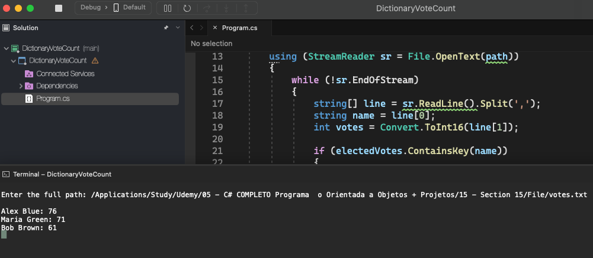

# Dictionary Vote Count

    - When counting votes in an election, several voting records are generated containing the candidate's name and the number of votes (.csv format) he obtained in a voting box. You must write a program to read the voting records from a file, and then generate a consolidated report with the totals for each candidate.

  

