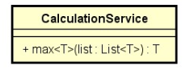
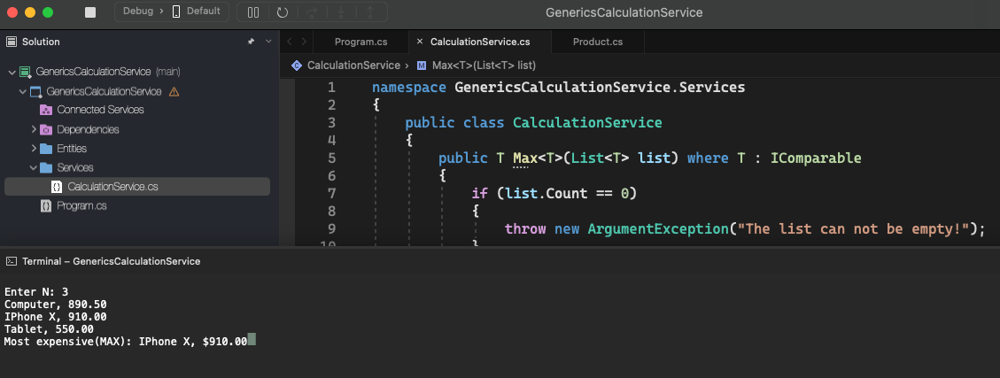

# Generics Calculation Service

    - A consulting company wants to evaluate the performance of products, employees, among other things. One of the calculations it needs is to find the largest among a set of elements. Make a program that reads a set of N products, and then shows the most expensive of them.

  

  

