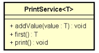
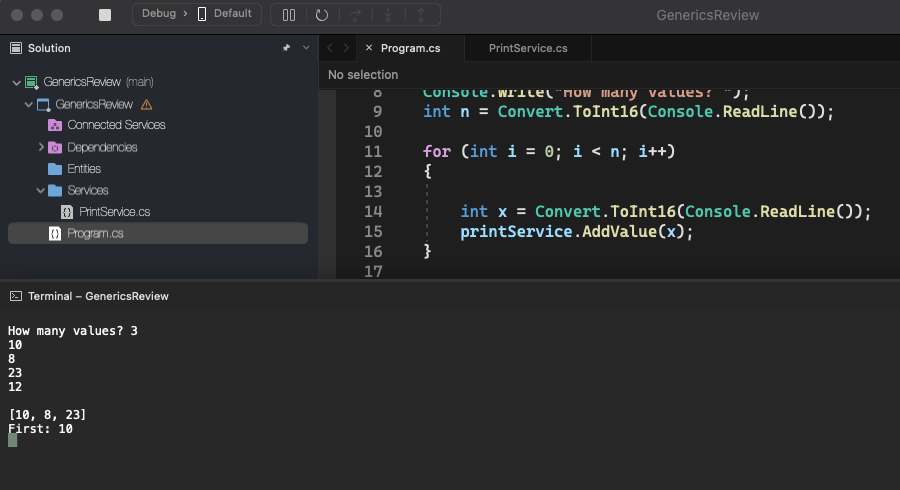

# Generics Review

    - You have to write a program that reads a set of N integers (N from 1 to 10), and then prints these numbers in an organized way. Then, inform what was the first value reported.

  

  

