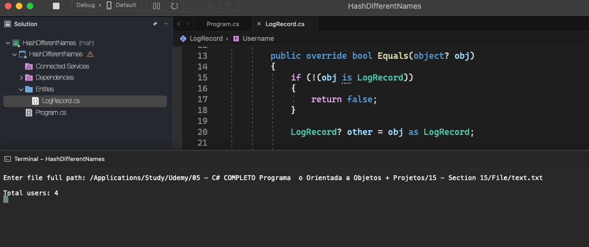

# Hash Different Names

    - A website records a user access log. A log record consists of the user name and the time when the user accessed the website in the ISO 8601 standard, separated by spaces. Create a program that reads the access log from a file, and then reports how many different users accessed the website.

  

