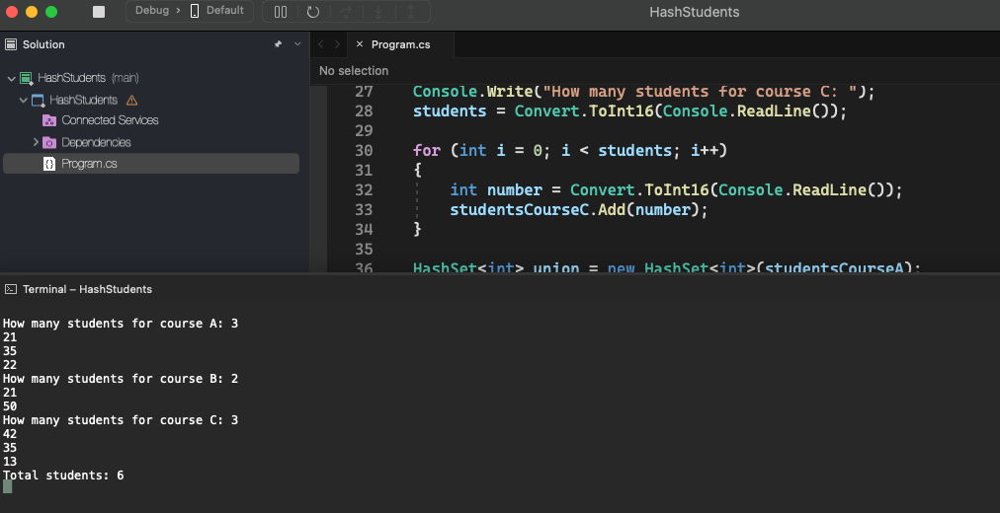

# Hash Students

    - In an online course portal, each user has a unique code, represented by an integer.
    Each instructor on the portal can have several courses, and the same student can enroll in as many courses as they want. Thus, an instructor's total number of students is not simply the sum of students from all the courses he has, as there may be repeat students in more than one course.
    Instructor Alex has three courses A, B, and C, and wants to know his total number of students.
    Your program should read the students from instructor Alex's courses A, B and C, then show the total number and his students.

  

