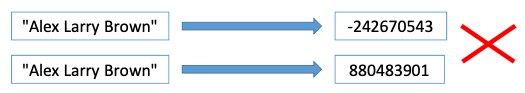

# 15 Section - Generics, Set, Dictionary

### Generics

      • Generics allow classes, interfaces and methods to be parameterized by type. Its benefits are:
            • Reuse;
            • Type safety;
            • Performance;

      • Common use: collections:
        List<string> list = new List<string>();
        list.Add("Jim");
        string name = list[0];

##### Constraints on type parameters

      • where T: struct;
      • where T : class;
      • where T : unmanaged;
      • where T : new();
      • where T : <base type name>;
      • whereT:U;
      • https://learn.microsoft.com/en-us/dotnet/csharp/programming-guide/generics/constraints-on-type-parameters

### GetHashCode and Equals

      • These are operations of the Object class used to compare whether one object is equal to another;
      • Equals: slow, 100% response;
      • GetHashCode: fast, but positive response is not 100%;
      • The pre-defined types already have implementation for these operations. Custom classes and structs need to override them;

##### Equals

      • Method that compares whether the object is equal to another, returning true or false:

      string a = "Maria";
      string b = "Alex";
      Console.WriteLine(a.Equals(b));

##### GetHashCode

      • Method that returns an integer representing a code generated from the object information:

      string a = "Maria";
      string b = "Alex";
      Console.WriteLine(a.GetHashCode());
      Console.WriteLine(b.GetHashCode());

##### GetHashCode rule of thumb

      • If the code of two objects is different, then the two objects are different:

  

      • If the code of two objects is the same, most likely the objects are the same (there may be a collision);

### HashSet<T> and SortedSet<T>

      • Represents a set of elements (similar to Algebra):
            • Does not admit repetitions;
            • Elements have no position;
            • Access, insertion and removal of elements are fast;
            • Provides efficient set operations: intersection, union, difference;

      • HashSet:
            • https://msdn.microsoft.com/en-us/library/bb359438(v=vs.110).aspx
      • SortedSet:
            • https://msdn.microsoft.com/en-us/library/dd412070(v=vs.110).aspx

##### Differences

      • HashSet:
            • Storage in a hash table;
            • Extremely fast: O(1) insertion, removal and search;
            • Element order is not guaranteed;

      • SortedSet:
            • Tree storage;
            • Fast: O(log(n)) insertion, removal and search;
            • Elements are stored in order according to the IComparer<T> implementation;

##### Some important methods

      • Add;
      • Clear;
      • Contains;
      • UnionWith(other) - union operation: adds elements from the other set to the set, without repetition;
      • IntersectWith(other) - intersection operation: removes elements not contained in other from the set;
      • ExceptWith(other) - difference operation: removes the elements contained in other from the set;
      • Remove(T);
      • RemoveWhere(predicate);

### How do Hash collections test equality?

      • If GetHashCode and Equals are implemented:
            • First GetHashCode. If it is equal, use Equals to confirm;

      • If GetHashCode and Equals are NOT implemented:
            • Reference types: compares object references;
            • Value types: compare attribute values;

### Dictionary e SortedDictionary

##### Dictionary<TKey, TValue>

      • It is a collection of key/value pairs:
            • Does not allow repetition of the key object;
            • Elements are indexed by the key object (they have no position);
            • Access, insertion and removal of elements are fast;

      • Common use: cookies, local storage, any key-value model;

      • Dictionary:
            • https://msdn.microsoft.com/en-us/library/xfhwa508(v=vs.110).aspx

      • SortedDictionary:
            • https://msdn.microsoft.com/en-us/library/f7fta44c(v=vs.110).aspx

##### Differences

      • Dictionary:
            • Storage in a hash table;
            • Extremely fast: O(1) insertion, removal and search;
            • Element order is not guaranteed;

      • SortedDictionary:
            • Tree storage;
            • Fast: O(log(n)) insertion, removal and search;
            • Elements are stored in order according to the IComparer<T> implementation;

##### Some important methods

      • dictionary[key] - accesses the element using the given key;

      • Add(key, value) - adds element (exception in case of repetition);
      • Clear() - empties the collection;
      • Count - number of elements;
      • ContainsKey(key) - checks if the given key exists;
      • ContainsValue(value) - checks if the given value exists;
      • Remove(key) - removes an element by key;
