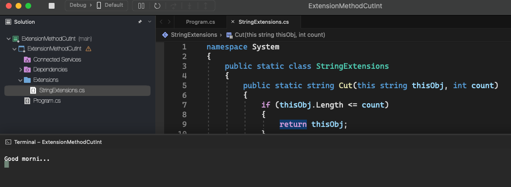

# Extension Method Cut Int

    - Let's create an extension method called "Cut(int)" in the String class to receive an integer value as a parameter and generate a cut of the original string of that size. For example:

    String s1 = "Good morning dear students!";
    Console.WriteLine(s1.Cut(10));
    "Good morni..."

  

