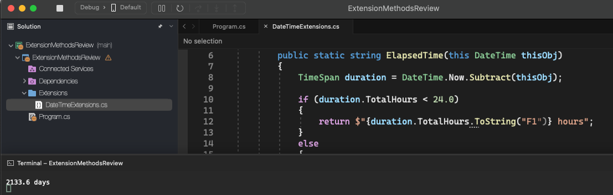

# Extension Methods Review

    - Let's create an extension method called "ElapsedTime()" in the DateTime struct to present a DateTime object in the form of elapsed time, which can be in hours (if less than 24h) or in days otherwise. For example:

    DateTime dt = new DateTime(2018, 11, 16, 8, 10, 45);
    Console.WriteLine(dt.ElapsedTime());
    "4.5 hours"
    "3.2 days"

  

