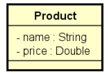
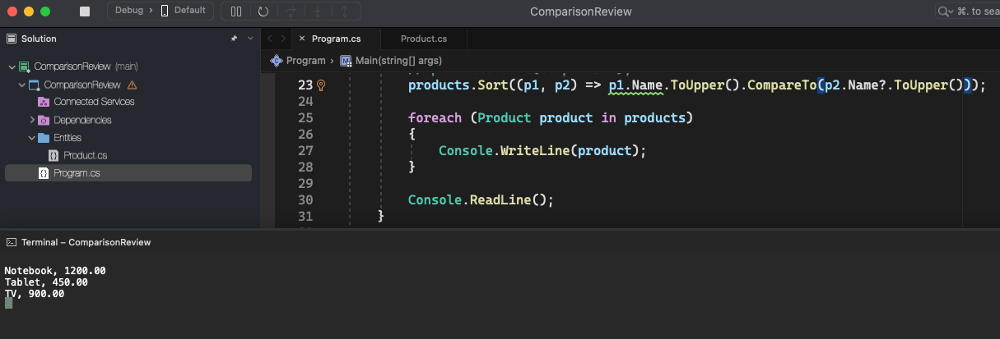

# Comparison Review

    - Suppose a Product class with name and price attributes. Suppose we need to sort a list of Product objects.
    - We can implement product comparison by implementing the IComparable<Product> interface.
    - However, this way our Product class is not closed to change: if the comparison criteria change, we will need to change the Product class.
    - We can then use another overload of the "Sort" method of the List class:
      public void Sort(Comparison<T> comparison)

  

  

