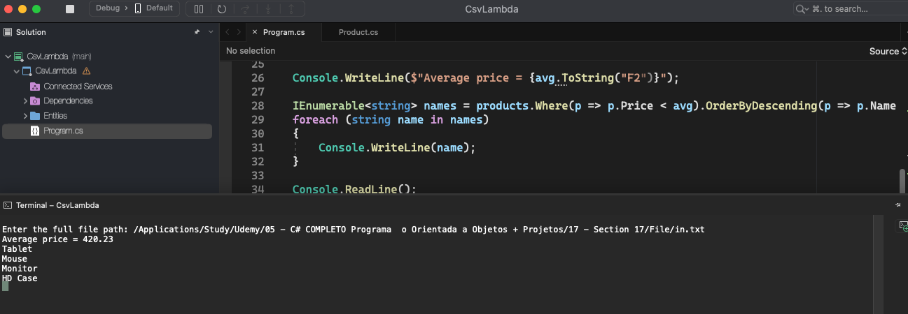

# Csv Lambda

    - Make a program to read a set of products from a file in .csv format (assume there is at least one product).
    Then show the average price of the products. Then, show the names, in descending order, of the products that have a price lower than the average price.

  

