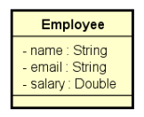
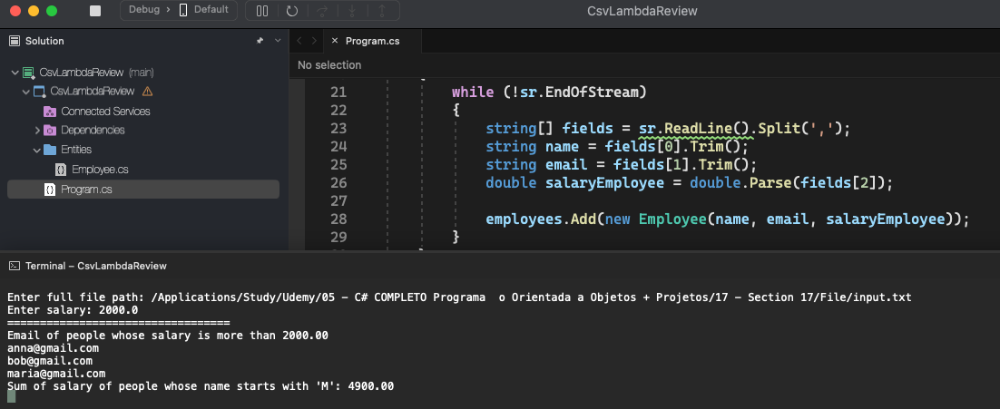

# Csv Lambda Review

    - Create a program to read employee data (name, email and salary) from a .csv file.
    - Then show, in alphabetical order, the email addresses of employees whose salary is higher than a given value provided by the user.
    - Also show the sum of salaries of employees whose name starts with the letter 'M'.

  

  

